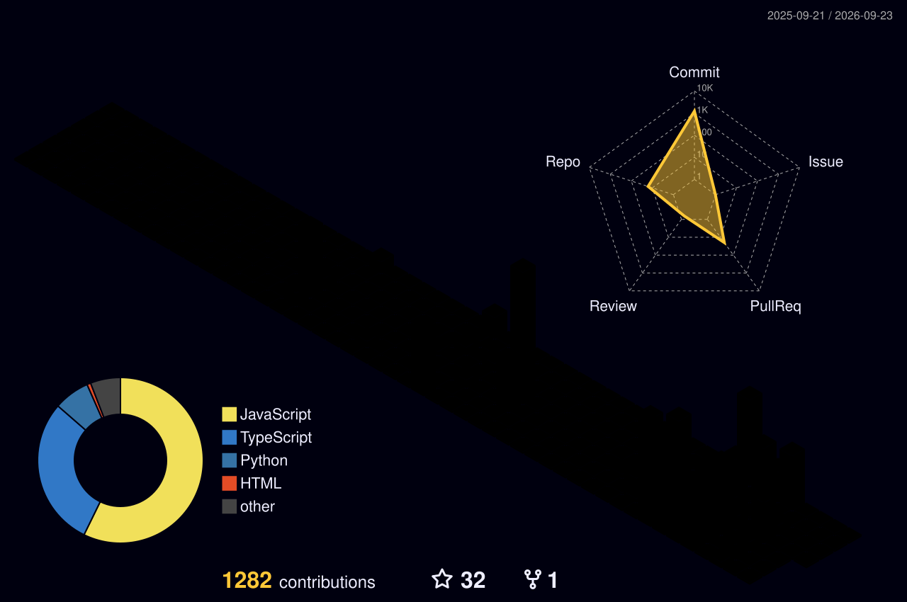

  

<h1 align="center">
  
</h1>

  

  
  
  
  
  

  
  
  

---

<h2 align="center">01 · Profile</h2>

DEVELOPER BY LOGIC · CREATOR BY INSTINCT · EXPLORER BY NATURE

<table>
  <tr>
    <td valign="middle">
      <h3>✨ About Me</h3>
      
嗨，我是 <strong>Wayne</strong>，熱愛健身、旅行與程式開發。

      
我希望透過軟體與自動化流程減少重複勞動，把想法變成真正改善生活的工具。

      
<strong>We use code to build a better society—and to remind people how wonderful life can be.</strong>

    </td>
    <td width="120" align="center" valign="middle">
      
    </td>
  </tr>
</table>

---

<h2 align="center">02 · Journey</h2>

EXPERIENCE · QUALITY · GROWTH

<table>
  <tr>
    <td valign="middle">
      <h3>🏢 Work Experience</h3>
      
<strong><a href="https://www.asus.com/tw/">ASUS Taiwan</a></strong> · 2024-06 — 2025-06

      <ul>
        <li><strong>團隊：</strong>系統品質軟體部</li>
        <li><strong>工作內容：</strong>參與軟體相容性測試</li>
      </ul>
    </td>
    <td width="170" align="center" valign="middle">
      
    </td>
  </tr>
</table>

---

<h2 align="center">03 · Visual Note</h2>

KEEP LOOKING FORWARD

  <picture>
    <source media="(prefers-color-scheme: dark)" srcset="https://media1.giphy.com/media/v1.Y2lkPTc5MGI3NjExYmZ4YXVxYmpuamR4OG9zaHk4eDU1bnA3NHA5NHMyOHJiaTh0ZmJsZCZlcD12MV9pbnRlcm5hbF9naWZfYnlfaWQmY3Q9Zw/RGyUJwAFjP38P3uEiV/giphy.gif" />
    <source media="(prefers-color-scheme: light)" srcset="https://media1.giphy.com/media/v1.Y2lkPTc5MGI3NjExYmZ4YXVxYmpuamR4OG9zaHk4eDU1bnA3NHA5NHMyOHJiaTh0ZmJsZCZlcD12MV9pbnRlcm5hbF9naWZfYnlfaWQmY3Q9Zw/RGyUJwAFjP38P3uEiV/giphy.gif" />
    
  </picture>

---

<h2 align="center">04 · Featured Projects</h2>

SELECTED WORK · BUILT WITH PURPOSE

<table>
  <tr>
    <td width="33%" valign="top">
      <h3><a href="https://github.com/WayneLY-Chen/Money-calculator">Money Calculator</a></h3>
      
High-precision bill partitioning for complex group expenses.

      
<code>TypeScript</code> <code>React Native</code>

    </td>
    <td width="33%" valign="top">
      <h3><a href="https://github.com/WayneLY-Chen/Daily-Tech-Digest">Daily Tech Digest</a></h3>
      
AI-driven daily technical news from GitHub and Hacker News.

      
<code>JavaScript</code> <code>AI</code>

    </td>
    <td width="33%" valign="top">
      <h3><a href="https://github.com/WayneLY-Chen/ECHO-Archive">ECHO Archive</a></h3>
      
A digital archive for family heritage and chronological storytelling.

      
<code>React</code> <code>Storytelling</code>

    </td>
  </tr>
</table>

---

<h2 align="center">05 · Contribution Garden</h2>

SMALL STEPS · EVERY DAY

  <picture>
    <source media="(prefers-color-scheme: dark)" srcset="https://raw.githubusercontent.com/WayneLY-Chen/WayneLY-Chen/output/github-contribution-grid-snake-dark.svg?v=RGB" />
    <source media="(prefers-color-scheme: light)" srcset="https://raw.githubusercontent.com/WayneLY-Chen/WayneLY-Chen/output/github-contribution-grid-snake.svg?v=RGB" />
    
  </picture>

---

<h2 align="center">06 · GitHub Data</h2>

CONTRIBUTIONS · LANGUAGES · CONSISTENCY

  
  

  

---

<h2 align="center">07 · Links</h2>

LET'S CONNECT

  
  
  

---

<h2 align="center">08 · Technology Stack</h2>

TOOLS I USE TO TURN IDEAS INTO SYSTEMS

  
  
  
  
  
  
  
  
   
  
  
  
  
  
  
  
   
  
  
  
  

---

<h2 align="center">09 · Immortality & Activity</h2>

THE CULTIVATION JOURNEY CONTINUES

  

  <picture>
    <source media="(prefers-color-scheme: dark)" srcset="https://github-readme-activity-graph.vercel.app/graph?username=WayneLY-Chen&bg_color=F7F1E7&color=302A25&line=8B5E3C&point=8B5E3C&area_color=CDBDA8&area=true&hide_border=false&radius=10" />
    <source media="(prefers-color-scheme: light)" srcset="https://github-readme-activity-graph.vercel.app/graph?username=WayneLY-Chen&bg_color=F7F1E7&color=302A25&line=8B5E3C&point=8B5E3C&area_color=CDBDA8&area=true&hide_border=false&radius=10" />
    
  </picture>

  

  

---

  <strong>Let’s build something meaningful together.</strong> 
  用程式減少重複勞動，也用創造讓生活更美好。

